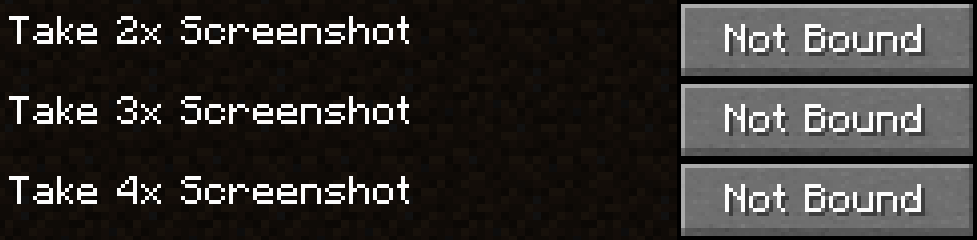

<section>

This mod lets you take higher resolution screenshots, notably, in resolutions 2x, 3x and 4x bigger resolution than your screen size.

You can take the screenshots using one of the 3 new keybinds that the mod adds:

Here are some examples of the different resolutions of screenshots:

<a href="https://assets.blamejared.com/bigshot/1x.png" rel="nofollow">1x resolution (2560x1377) (4.2MB)</a>

<a href="https://assets.blamejared.com/bigshot/2x.png" rel="nofollow">2x resolution (5120x2754) (15.8MB)</a>

<a href="https://assets.blamejared.com/bigshot/3x.png" rel="nofollow">3x resolution (7680x4131) (34.1MB)</a>

<a href="https://assets.blamejared.com/bigshot/4x.png" rel="nofollow">4x resolution (10240x5508) (56.4MB)</a>

If you would like to support me in my modding endeavors, you can become a patron via <strong><a href="https://www.patreon.com/jaredlll08" rel="nofollow">Patreon</a></strong>.

<strong>This project is sponsored by Nodecraft. Use code <a href="/linkout?remoteUrl=https%253a%252f%252fnodecraft.com%252fr%252fjared" rel="nofollow">JARED</a> for 30% off your first month of service!</strong>

</section>